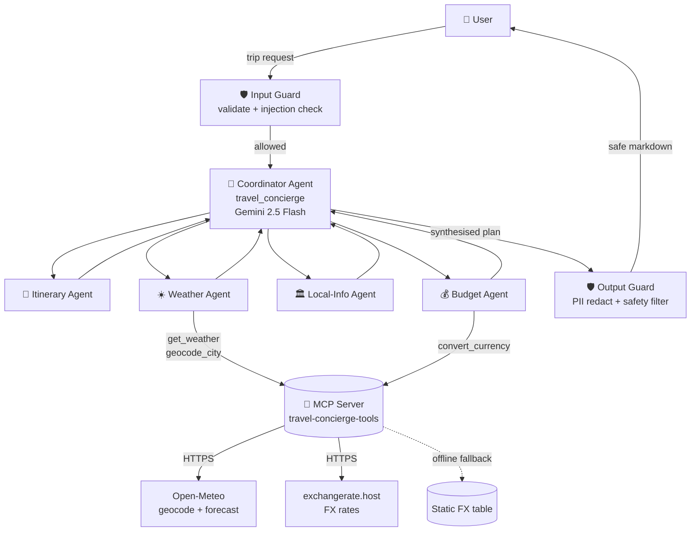
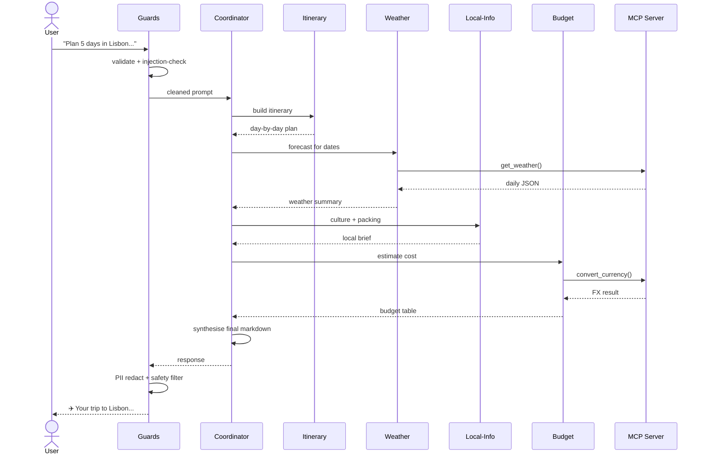

# Architecture

## High-level overview

## Why this design

- **Coordinator + specialists** keeps each prompt tight, lets sub-agents
  reason in parallel and makes it easy to add new specialists (e.g. a
  Visa Agent or Flight Agent) later without touching the others.
- **MCP server** is the contract layer between the LLM agents and the
  outside world. Any MCP-aware client (Claude Desktop, GitHub Copilot
  CLI, another ADK app) can plug in and reuse the same tools.
- **Guards run on both sides** of the agent loop, so a compromised
  sub-agent can't leak secrets and a malicious user can't easily smuggle
  jailbreak instructions through.
- **Graceful offline mode** — every external call is wrapped; on network
  failure the agents still produce a useful (if less precise) answer,
  which is essential for Kaggle's offline-notebook judging environment.

## Component reference

| Component | Type | Purpose | File |
|---|---|---|---|
| `travel_concierge` | ADK `Agent` (root) | Orchestrates sub-agents and synthesises the final response | `agents/coordinator.py` |
| `itinerary_agent` | ADK `Agent` | Builds day-by-day plan from interests + duration | `agents/itinerary_agent.py` |
| `weather_agent` | ADK `Agent` + tools | Forecasts weather for the trip dates | `agents/weather_agent.py` |
| `budget_agent` | ADK `Agent` + tools | Per-category cost estimate + FX conversion | `agents/budget_agent.py` |
| `local_info_agent` | ADK `Agent` | Culture, etiquette, safety, packing list | `agents/local_info_agent.py` |
| `travel-concierge-tools` | MCP server (fastmcp) | Exposes `get_weather`, `convert_currency`, `geocode_city` | `mcp_server/server.py` |
| `guards` | Pure-Python module | 4 guardrails wrapping every input/output | `security/guards.py` |
| `runner` | asyncio wrapper | Wires guards → ADK Runner → final markdown | `runner.py` |

## Sequence of a request

